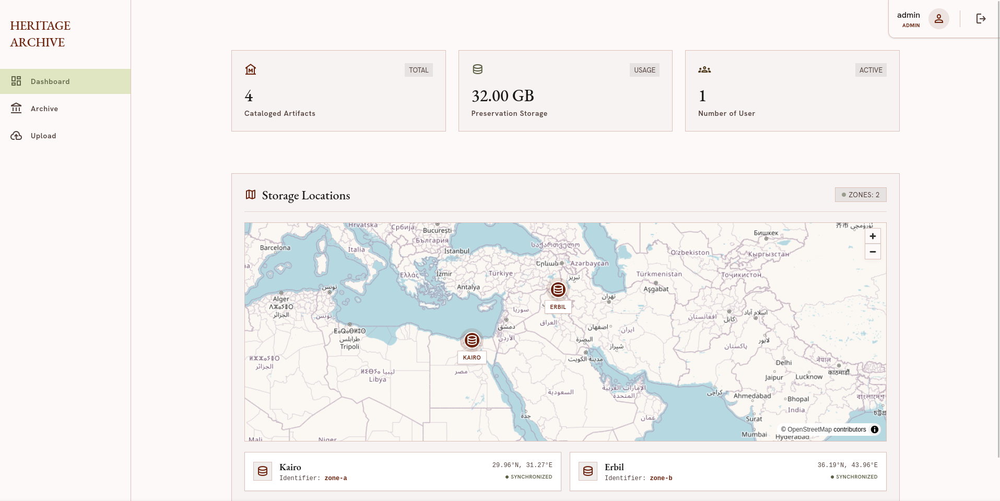

<div align="center">
    <h1> OPA for Ceph Multi-Site</h1>
    
</div>

<p align="center" style="padding: 5pt;">
    
    
</p>

<p align="center">Integration des <a href="https://github.com/open-policy-agent/OPA">Open Policy Agents (OPA)</a> in ein <a href="https://github.com/ceph/ceph">Ceph</a>-Multisite-Setup zur dynamischen Durchsetzung
  datensouveräner Speicher- und Replikationsrichtlinien für digitales Kulturerbe.</p>



## ✨ Features

Open Policy Agent entscheidet:

- Welche Site / Ceph Zone (z. B. zone-a / zone-b)
- Ob Nutzer die Daten erstellen darf
- Ob Nutzer die Daten verändern darf
- Welche Replikation oder Erasure Coding Policy

Ergebnis: OPA ist „Policy Compiler“, Ceph ist „Execution Engine“

## ⚙️ Setup

### Gesamtsystem mit Docker / Podman Compose starten

Startet **PostgreSQL 18**, **OPA**, den **Decision Service** und baut das **Frontend**:

```bash
docker compose up -d --build
# oder mit podman:
podman compose up -d --build
```

Dienste:
- **Frontend (UI):** [http://localhost:3000](http://localhost:3000)
- **Decision Service (API):** [http://localhost:8000](http://localhost:8000) / [Docs](http://localhost:8000/docs)
- **OPA:** [http://localhost:8181](http://localhost:8181)
- **PostgreSQL 18:** `localhost:5432`

---

### Manuelles / Lokales Entwicklungs-Setup

#### 1. Policy Layer (OPA)

```bash
cd opa
podman compose up -d
```

#### 2. Decision Layer (Service)

```bash
cd decision_service
source .venv/bin/activate
# Nutzt PostgreSQL (z. B. via docker/podman compose)
fastapi dev src/main.py
```

#### 3. Frontend

React Webseite um Uploads und Zonen-Routing zu visualisieren:

```bash
cd frontend
bun install
bun run dev
```
